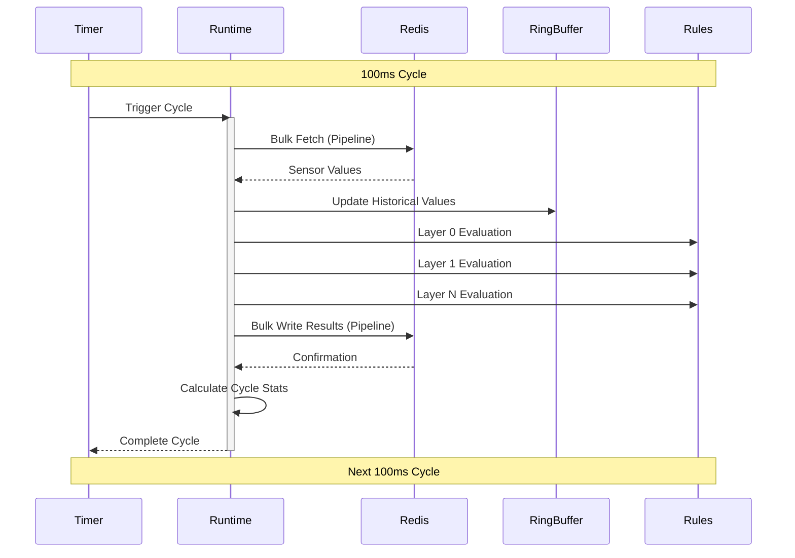

# Rules Engine

## Overview

Pulsar is a high-performance, AOT-compatible rules evaluation engine designed to process hundreds to thousands of key/value inputs using Redis as its primary data store. It uses a template-based code generation approach to create standalone Beacon applications that fetch inputs, apply rules, and write outputs back on a configurable schedule (default 100ms). The system's primary goal is to provide deterministic, real-time evaluations with minimal runtime overhead while maintaining full compatibility with AOT compilation environments.

## Key Concepts

### Rule Definitions (YAML/DSL)

Rules are defined in YAML using this structure:
```yaml
rules:
  - name: "ExampleRule"      # Required, unique identifier
    description: "..."       # Optional description
    conditions:             # Required condition group
      all:                  # or 'any'
        - condition:        # Individual condition
            type: "comparison|threshold_over_time|expression"
            # Additional fields based on type
    actions:               # Required list of actions
      - action_type:       # set_value or send_message
          # Action-specific fields
```

### Supported Condition Types

1. **Comparison Condition**
```yaml
condition:
  type: comparison
  sensor: "sensor_name"
  operator: "<|>|<=|>=|==|!="
  value: <number|string|boolean|object>  # Supports various data types
```

2. **Expression Condition**
```yaml
condition:
  type: expression
  expression: "sensor_a + (sensor_b * 2) > 100"  # Complex expressions supported
```

3. **Threshold Over Time**
```yaml
condition:
  type: threshold_over_time
  sensor: "sensor_name"
  threshold: <number>
  duration: <milliseconds>
  # Now supports object values in the temporal buffer
```

4. **Object Property Comparison**
```yaml
condition:
  type: comparison
  sensor: "complex_sensor"
  property: "status.active"  # Access nested properties
  operator: "=="
  value: true
```

### Supported Actions

1. **Set Value**
```yaml
set_value:
  key: "output_sensor"
  value_expression: "sensor_a * 2"  # Supports complex expressions
  # Can set numeric, string, boolean, or complex object values
```

2. **Send Message**
```yaml
send_message:
  channel: "alert_channel"  # Redis pub/sub channel
  message: "Alert text"  # Static message text
```

3. **Send Dynamic Message**
```yaml
send_message:
  channel: "alert_channel"
  message_expression: "'Temperature: ' + temperature + ' exceeds threshold'"  # Dynamic message
  include_data: true  # Optionally include sensor data in the message
```

## Rule Dependencies and Execution Order

- Rules can reference **computed values from prior layers**.
- The system performs a **topological sort** to determine rule execution order.
- **Circular dependencies cause build-time failure**.
- **Maximum allowed dependency depth** is configurable (default: 10 levels) with warnings for deep chains.
- Actions execute **sequentially in defined order**.

## Temporal Handling

- **Default Mode: Strict Discrete**: The system only trusts explicit data points. If no new reading is available within a time window, it assumes no change has occurred.
- **Extended Last-Known Mode**: If enabled in the DSL, missing data points will be interpolated using the last known value until a new data point contradicts it.
- **Temporal rules utilize an in-memory ring buffer** to retain historical values needed for evaluation.

## Template-Based Code Generation

The compiler **validates rule syntax**, **performs dependency analysis**, and **generates optimized C# code** using templates from the `Pulsar.Compiler/Config/Templates` directory. The compiled output is a **complete, standalone C# solution** named **Beacon**, containing:
- `Beacon.sln` - The main solution file (from Templates/Project)
- `Beacon.Runtime/` - The main runtime project
  - `Beacon.Runtime.csproj` - Runtime project file (from Templates/Project)
  - `Program.cs` - Entry point with AOT attributes
  - `Generated/` - Contains all generated rule files
  - `Services/` - Core runtime services (from Templates/Runtime/Services)
  - `Buffers/` - Temporal buffer implementation (from Templates/Runtime/Buffers)
  - `Interfaces/` - Core interfaces (from Templates/Interfaces)
- `Beacon.Tests/` - Test project for generated rules
  - `Beacon.Tests.csproj` - Test project file
  - `Generated/` - Generated test files

## Runtime Execution

The **Beacon.Runtime** executable fetches **bulk sensor values from Redis every 100ms**. **Rules execute in dependency-resolved layers** to maintain deterministic evaluation. Computed results are **written back to Redis** after processing.

### Action Type Behaviors

The system handles different action types with distinct timing behaviors:

- **`set_value` actions**: These are collected during rule evaluation and stored temporarily. At the end of each evaluation cycle, all `set_value` results are written back to Redis in a single bulk operation, maintaining a predictable cadence.

- **`send_message` actions**: These are executed asynchronously as they are triggered during rule evaluation. Messages are sent immediately to their target channels and don't wait for the evaluation cycle to complete, allowing for real-time notifications independent of the bulk update cycle.

This design provides both consistent state updates and responsive notifications.

The execution sequence is as follows:



## Template-Based Compilation Process

1. **Validation Phase**
   - Validate YAML structure, sensor references, and expressions.
   - Detect circular dependencies.

2. **Dependency Analysis**
   - Compute evaluation order and assign rule layers.
   - Create dependency graph for topological sorting.

3. **Template Selection**
   - Select appropriate templates from `Pulsar.Compiler/Config/Templates`.
   - Prepare template data models based on rule definitions.

4. **Code Generation**
   - Generate optimized C# code using the selected templates.
   - Include temporal buffer logic if needed.
   - Apply AOT compatibility attributes and configurations.

## Performance and Stability

- **AOT Compatibility**: Fully compatible with AOT compilation for deployment in environments without JIT.
- **Deterministic timing**: Ensures all evaluations complete within the configured cycle time.
- **Minimal overhead**: Uses **precompiled code** and **index-based lookups** instead of dictionaries.
- **Scalability**: Capable of handling thousands of rules efficiently.
- **Reduced memory footprint**: Optimized for minimal memory usage with proper trimming support.
- **Fast startup time**: AOT-compiled applications start instantly without JIT compilation delay.

## Example Rules

### Basic Temperature Alert Rule

```yaml
rules:
  - name: "TemperatureAlert"
    description: "Sends an alert when temperature is above threshold for 5 minutes"
    conditions:
      all:
        - condition:
            type: threshold_over_time
            sensor: "temperature"
            operator: ">"
            threshold: 80
            duration: 300000  # 5 minutes in milliseconds
    actions:
      - send_message:
          channel: "alerts"
          message: "Temperature has been above 80 degrees for 5 minutes"
      - set_value:
          key: "alert_status"
          value: "active"
```

### Complex Object Value Rule

```yaml
rules:
  - name: "DeviceStatusAlert"
    description: "Monitors device status objects and sends alerts when critical devices are offline"
    conditions:
      all:
        - condition:
            type: comparison
            sensor: "device_status"
            property: "status.online"  # Access nested property in object
            operator: "=="
            value: false
        - condition:
            type: comparison
            sensor: "device_status"
            property: "metadata.priority"
            operator: "=="
            value: "critical"
    actions:
      - send_message:
          channel: "device_alerts"
          message_expression: "'Critical device ' + device_status.name + ' is offline!'"
      - set_value:
          key: "maintenance_required"
          value_expression: "{deviceId: device_status.id, priority: 'high', timestamp: Date.now()}"  # Set complex object
```

## Best Practices

1. **Rule Organization**
   - Group related rules together
   - Use clear, descriptive names
   - Add meaningful descriptions

2. **Dependency Management**
   - Keep dependency chains short
   - Avoid complex circular references
   - Use layering to organize rule execution

3. **Performance Optimization**
   - Minimize the number of conditions per rule
   - Use simple expressions where possible
   - Only use temporal conditions when necessary

4. **AOT Compatibility**
   - Avoid dynamic code generation in custom extensions
   - Use JSON serialization contexts for complex objects
   - Follow trimming guidelines when extending the system
   - Test with PublishAot=true to verify compatibility

5. **Testing**
   - Create test cases for each rule
   - Verify rule behavior with different inputs
   - Test edge cases and boundary conditions
   - Validate AOT compatibility of generated code
